# Aerie Part Management - Flow Overview

> Visual flows with consistent color themes and quick-reading legends.

Legend: 🟦 Frontend · 🟪 Backend · 🟩 Data/DB · 🟧 Files · 🟨 Build/Deploy

---

## System Architecture Flow


---

## Authentication Flow


---

## Part Lifecycle Flow


---

## Part Creation Flow

```mermaid
flowchart TD
    A[Click Add] --> B[Open Add Modal]
    B --> C[Fill Fields]
    C --> D{Required ok?\nID · Material · Subsystem}
    D -- No --> E[Show inline errors]
    E --> C
    D -- Yes --> F[Optional fields\nname/type/notes/etc.]
    F --> G[Upload files?]
    G --> H[Submit]
    H --> I{Validate}
    I -- Fail --> E
    I -- Pass --> J[POST /api/parts]
    J --> K[Create record]
    K --> L[Update state]
    L --> M[Refresh UI + toast]

    classDef good fill:#dcfce7,stroke:#22c55e;
    classDef warn fill:#fef9c3,stroke:#f59e0b;
    classDef bad fill:#fee2e2,stroke:#ef4444;
    class D good;
    class E bad;
    class L,M good;
```



---

## File Upload and Conversion Flow


---

## API Communication Flow

```mermaid
flowchart LR
    subgraph FE["Frontend Calls 🟦"]
        A1[partsApi.js\n(high-level)]
        A2[apiClient.js\n(fetch wrapper)]
        A3[auth.js\ncookies + key]
    end

    subgraph BE["Backend Routes 🟪"]
        B1[Blueprint: parts_bp]
        B2[Auth middleware]
        B3[File handlers]
    end

    subgraph DB["Data Layer 🟩"]
        C1[Part Model]
        C2[SQLAlchemy]
        C3[SQLite]
    end

    A1 -->|CRUD| B1
    A2 -->|HTTP| B1
    A3 -->|API key| B2
    B1 --> B3
    B1 --> C1
    C1 --> C2 --> C3
    B3 -.->|Files| FS[(File System 🟧)]

    classDef fe fill:#e3f2fd,stroke:#60a5fa;
    classDef be fill:#f3e8ff,stroke:#a855f7;
    classDef db fill:#dcfce7,stroke:#22c55e;
    classDef fs fill:#fff7ed,stroke:#fb923c;
    class A1,A2,A3 fe;
    class B1,B2,B3 be;
    class C1,C2,C3 db;
    class FS fs;
```

---

## Search and Filter Flow

```mermaid
flowchart TD
    A[Type query] --> B[Live filter]
    B --> C[Category filter]
    C --> D[Match fields:\nname · notes · subsystem · assigned · material · partId]
    D --> E[Apply sort\nalpha/date toggle]
    E --> F[Update UI]
    F --> G[Render results]

    H[Tab click] --> I[Load category]
    I --> C

    J[Sort click] --> K[Toggle direction]
    K --> E

    classDef fe fill:#e3f2fd,stroke:#60a5fa;
    class A,B,C,D,E,F,G,H,I,J,K fe;
```



---

## Deployment Flow

```mermaid
graph TB
    subgraph Dev["Development 🟨"]
        DEV[Local dev]
        DEV_FRONT[npm run dev]
        DEV_BACK[uv run python run.py]
    end

    subgraph Build["Production Build 🟨"]
        BUILD_FRONT[npm run build]
        BUILD_BACK[uv run python deploy.py prod-multi]
    end

    subgraph Runtime["Production Runtime 🟩/🟪"]
        PROD_FRONT[Static host\n(Nginx/etc)]
        PROD_BACK[Gunicorn workers]
        PROD_DB[(SQLite / PostgreSQL)]
    end

    DEV --> BUILD_FRONT
    DEV --> BUILD_BACK
    BUILD_FRONT --> PROD_FRONT
    BUILD_BACK --> PROD_BACK
    PROD_FRONT --> PROD_BACK
    PROD_BACK --> PROD_DB

    classDef dev fill:#e0f2fe,stroke:#38bdf8;
    classDef build fill:#f3e8ff,stroke:#a855f7;
    classDef run fill:#dcfce7,stroke:#22c55e;
    class DEV,DEV_FRONT,DEV_BACK dev;
    class BUILD_FRONT,BUILD_BACK build;
    class PROD_FRONT,PROD_BACK,PROD_DB run;
```

---

## Error Handling Flow


---

## Key System Flows Summary

### User Journey
1. **Authenticate** → enter API key and load data.
2. **Discover** → search/filter across categories.
3. **Create** → add parts with validation and uploads.
4. **Advance** → move parts through CNC/Hand to Completed.
5. **Assign** → track ownership and progress.
6. **Complete** → finalize and archive.

### Data Flow
- Frontend state ↔ Backend API ↔ Database.
- File uploads → Conversion service → 3D viewer.
- User actions → State updates → UI re-renders.

### Error Recovery
- Auth failures → prompt for key.
- Validation errors → inline highlights.
- Server issues → graceful messages and retry guidance.
- Network issues → retry after connection check.